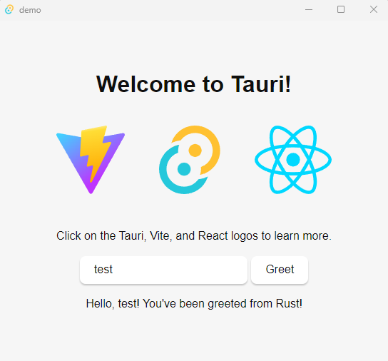

[Streamdog](/projects/streamdog) is a native Windows app that will imitate your clicks and keystrokes in real time, bringing some life to your stream or recording. It is an ideal companion for those who don’t want to use a camera. In this blog post we'll explore the technologies used behind the scenes.
- [Streamdog Project page (download & features showcase)](/projects/streamdog)
- [GitHub Repository](https://github.com/gpiskas/streamdog)


## Table of Contents

## Tech Stack
Streamdog is built using [Tauri](https://tauri.app/) and [React](https://react.dev/). I was already familiar with React and looked for a way to leverage my existing knowledge for building a native app. At this point I considered Tauri and Electron, and decided to go with the former which is the newer and more lightweight option. Tauri has proven to be very easy to use and work with. The developer experience just feels great.

### Tauri in a Nutshell
> Tauri is an open-source framework for building lightweight, fast, and secure desktop applications using web technologies like **JavaScript, TypeScript, and HTML/CSS**. It aims to provide a simple and flexible way to create desktop apps with modern web development practices. Tauri utilizes existing web frameworks such as **React, Vue.js, or Angular**, allowing developers to leverage their existing skills. \
\
Applications are be packaged into standalone binaries for different platforms (such as Windows, macOS, and Linux) while maintaining a small footprint and fast startup times. Tauri achieves this by leveraging the **Rust** programming language for the backend, which provides performance and security benefits. But don't worry if you are not familiar with it, as you don't need to touch it too much.

### React in a Nutshell
> React probably needs no introduction. It has risen to prominence as one of the most popular JavaScript libraries for building user interfaces due to its simplicity, efficiency, and developer-friendly features. Its **component-based** architecture facilitates the creation of reusable UI components, and its efficient rendering mechanisms contribute to faster performance. \
\
React's declarative syntax and **JSX** enhance code readability and maintainability, further bolstering its appeal. Supported by a robust ecosystem of libraries and tools, React enables developers to build feature-rich applications with ease.


## Creating a Basic Tauri & React App Template
Tauri has an excellent [Getting Started guide](https://tauri.app/v1/guides/getting-started/prerequisites/) which will explain everything you need to set up a basic project. Assuming you have installed the prerequisites listed in the guide, the easiest way to create a new Tauri app is through `npm`, which you will anyway need to build the UI.

```sh
npm create tauri-app@latest
```

This command will provide you with many choices for tools and frameworks, feel free to choose the ones you are the most comfortable with.

```sh
  Need to install the following packages:
  create-tauri-app@3.13.3
  Ok to proceed? (y) y
  ✔ Project name · demo
  ✔ Choose which language to use for your frontend · TypeScript / JavaScript - (pnpm, yarn, npm, bun)
  ✔ Choose your package manager · npm
  ? Choose your UI template ›
    Vanilla
    Vue
    Svelte
  ❯ React  (https://react.dev/)
    Solid
    Angular
    Preact
```

Once your template is created, simply go ahead and launch it, it can't get any simpler than that! These commands will download all necessary dependencies and build the native app, which will launch right after that.

```sh
  cd demo
  npm install
  npm run tauri dev
```




## Project Structure

<div class="grid sm:grid-flow-col grid-flow-row">
<div>
<p>This is the folder structure right after executing the commands above. Let's explore the items one by one:</p>
  <ul>
    <li><b>node_modules</b>: all installed dependencies declared in package.json</li>
    <li><b>public</b>: resources used in your app, such as images, unprocessed by the framework</li>
    <li><b>src</b>: React / UI code and resources</li>
    <li><b>/assets</b>: resources to be used by React, can be optimized by the framework</li>
    <li><b>src-tauri</b>: Tauri / Backend code and resources</li>
    <li><b>/icons</b>: used as native application icons</li>
    <li><b>/src</b>: Rust / Backend code</li>
    <li><b>/target</b>: build artifacts are stored here</li>
  </ul>

<p>Some important files:</p>
  <ul>
    <li><b>src-tauri/src/main.rs</b>: Tauri is bootstrapped here. Here is where you can create additional backend components and commands for the frontend to call, emit events, handle callbacks and so on.</li>
    <li><b>src-tauri/tauri.conf.json</b>: Tauri configuration properties are here, including feature flags, window and security options</li>
    <li><b>src-tauri/cargo.toml</b>: Rust dependencies are declared here, including Tauri</li>
    <li><b>package.json</b>: npm dependencies are declared here, including React</li>
  </ul>
</div>


</div>


## Tauri Backend Setup & Listening to Events

The main feature of Streamdog is to imitate your clicks and keystrokes in real time. To listen to these events, I used a Rust library called [`rdev`](https://crates.io/crates/rdev). I added the dependency in `Cargo.toml` and then created event listeners in `main.rs` that immediately re-emit the event to the frontend. Here is how I did this:

```rust
  ...
  fn spawn_event_listener(app: AppHandle) {
      tauri::async_runtime::spawn(async { rdev::listen(get_callback(app)).unwrap() });
  }

  fn get_callback(app: AppHandle) -> impl FnMut(Event) {
    return move |event: Event| match event.event_type {
        EventType::MouseMove { x, y } => {
            app.emit_all("MouseMove", [x, y]).unwrap();
        }
        EventType::KeyPress(key) => {
            app.emit_all("KeyPress", get_key_press_payload(key, event))
                .unwrap();
        }
        EventType::KeyRelease(key) => {
            app.emit_all("KeyRelease", get_key_press_payload(key, event))
                .unwrap();
        }
        EventType::ButtonPress(_button) => {
            app.emit_all("ButtonPress", true).unwrap();
        }
        EventType::ButtonRelease(_button) => {
            app.emit_all("ButtonRelease", true).unwrap();
        }
        _ => {}
    };
  }
  ...
```

To plug this into Tauri, you need to modify the main `Builder` method chain. In the following piece of code you can see a couple unrelated features. I am using the [`tauri_plugin_fs_watch`](https://github.com/tauri-apps/tauri-plugin-fs-watch) plugin to watch for file changes and reload the app in case a Streamdog skin was modified. Also I am exposing the (`get_display_size`) command for the frontend to invoke.

```rust
fn main() {
    tauri::Builder::default()
        .device_event_filter(tauri::DeviceEventFilter::Always)
        .setup(|app| {
            spawn_event_listener(app.app_handle());
            Ok(())
        })
        .invoke_handler(tauri::generate_handler![get_display_size])
        .plugin(tauri_plugin_fs_watch::init())
        .run(tauri::generate_context!())
        .expect("error while running tauri application");
}

#[tauri::command]
fn get_display_size() -> (u64, u64) {
    return rdev::display_size().unwrap();
}
```

This is more or less the complete setup of the Tauri and Rust backend. Short and sweet.

## Interaction between Tauri and React

On the frontend side, we can take advantage of APIs provided by Tauri to invoke backend commands, or listen to events. The following snippets are such examples.

```ts
import { invoke } from "@tauri-apps/api";

export function loadDisplaySize(): Promise<number[]> {
    return invoke('get_display_size');
}
```

```ts
import { listen } from '@tauri-apps/api/event';

export default function Mouse() {
  ...
  useEffect(() => {
    const unlistenPromise = listen('MouseMove', event => onMouseMove(event.payload as number[]));
    return () => {
      unlistenPromise.then(unlisten => unlisten());
    }
  }, []);
}
```

<p class="tip">Make sure you unregister listeners when React components are unmounted! The Tauri APIs typically will return a function that does exactly that when invoked.</a><p>

## How Streamdog Works

With the mouse and keyboard events exposed to the frontend, it's only a matter of consuming them and calculating positions and angles for the movement of the arms and other visual effects. The frontend of Streamdog is structured in components according to responsibility, such as `Mouse`, `Keyboard`, `DropArea` and so on. Each component listens to the events it needs and reacts accordingly.

Another crucial feature of Streamdog is skins support. Using Tauri APIs we are able to natively read and write to the file system, where the skins and config files are stored. Also, skin changes are immediately reflected on screen by watching for file system modifications.

Streamdog is built and released for Windows because that is the main use case - to be used along with gaming and streaming. However, there is nothing blocking it from being available on any other Tauri supported platform.

## Conclusion

By leveraging Tauri and React I was able to build Streamdog in a very short time frame while also learning new technologies and techniques. The developer experience is smooth and the feedback cycle is short enough to maintain your flow state. Using richer frameworks such as Next.js instead of plain React would also be a great option in case a full-blown application is required.